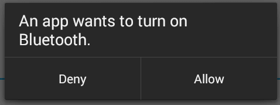

Welcome back.

Since you are here I am assuming that you have completed
[Project 1](../Project_1_-_Chat_App/Chat App - Part 1). If you
haven't then you should probably complete that first. This project will build on
some of the concepts gained from that one.

Well time to get started. This project will be creating a texting app that uses
bluetooth to send the messages.

First you need to create the project. The main activity is going to have:
- EditText for the user's name
- TextView label for the above EditText
- A ListView that is going to display the bluetooth devices that are available
(we will get to how in a minute)

In order to use bluetooth you must turn on bluetooth
permission in the Android Manifest file.

`<uses-permission android:name="android.permission.BLUETOOTH" />`

`<uses-permission android:name="android.permission.BLUETOOTH_ADMIN" />`

The Android Bluetooth APIs include a BluetoothAdapter class. This class is used
as a [singleton](http://whatis.techtarget.com/definition/singleton) to access the Bluetooth radio on the Android device. This class
must be instantiated in order to perform any Bluetooth related tasks in the
program.

```java
BluetoothAdapter bluetooth = BluetoothAdapter.getDefaultAdapter();```

If the device the above is run on does not support Bluetooth, the returned value
will be equal to "null". You should check for this
condition and update the app if needed. You could check for this with a simple
if statement:

```java
BluetoothAdapter bluetooth = BluetoothAdapter.getDefaultAdapter();

if(bluetooth != null)
{
    // Continue with bluetooth setup.
}
```
The next thing to check is if bluetooth has been enabled by the user.

```java
if (bluetooth.isEnabled()) {
    // Enabled. Work with Bluetooth.
}
else
{
    // Disabled. Do something else.
}
```

If bluetooth is disabled then we must request for the user to enable it. We do
this by calling `startActivityForResult` with *REQUEST_ENABLE_BT* action.

```java
Intent enableIntent = new Intent(BluetoothAdapter.ACTION_REQUEST_ENABLE);
startActivityForResult(enableIntent, REQUEST_ENABLE_BT);
```

This will open a dialog box to enable bluetooth on the device.



If the user clicks **Allow** then the
[onActivityResult()](https://developer.android.com/reference/android/app/Activity.html#onActivityResult(int,%20int, android.content.Intent))
method receives **RESULT_OK**
and if the user clicks **Deny** (or due to internal problem in device),
[RESULT_CANCELED](http://developer.android.com/reference/android/app/Activity.html#RESULT_CANCELED)
 is received. If returned value **RESULT_OK** is received then we will initiate the chat service.

All of this needs to happen in the `onCreate` function.

To start the chat, we first need to establish connection with the desired device. And before starting scanning for available devices, we usually get paired devices first in the list.

```java
Set<BluetoothDevice> pairedDevices = bluetooth.getBondedDevices();
```
http://www.theappguruz.com/blog/to-allow-two-way-text-chat-over-bluetooth-in-android
