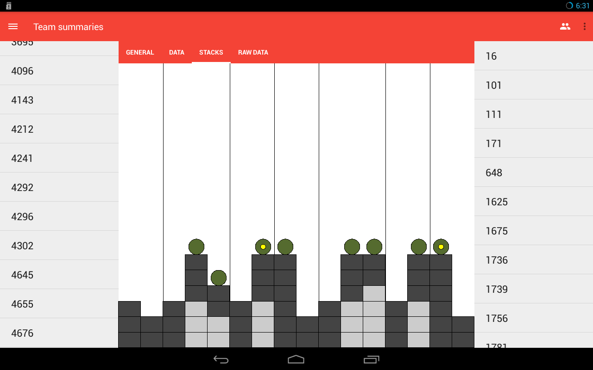
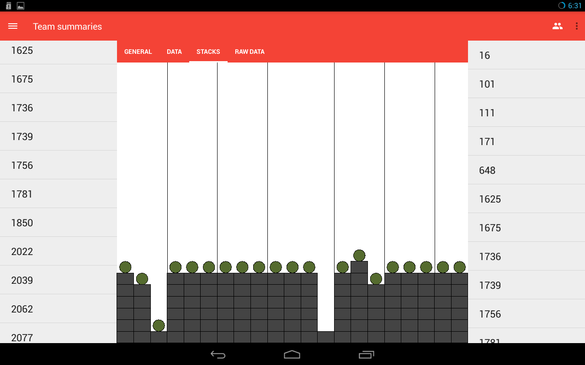

Up until now all of the widgets you have made just combined preexisting widgets
and views. Now you get to make a view that **draws** some of it own components.
For those that were on the team in 2015, you remember Recycle Rush right? (If you
don't remember you should probably get that checked out...) If you weren't on the
team a quick synopsis is your robot was suppose to build stacks of totes (up to
6 of them), and then put a trash can (called a container in the game) on top. You were also
suppose to put a pool noodle (called litter<sup>1</sup>) into the trash can.

Team 111 ([WildStang](http://www.thebluealliance.com/team/111), whom if you don't know you should as they won Worlds a couple times and were on Einstein a few more) had a mobile app where they created a simple view that allowed a user to quickly understand how a robot was creating stacks.





Your goal for this assignment is to create an app, where the user can enter an arbitrary number of matches and for each match enter an arbitrary number of stacks. For each stack they need to be able to put in number of totes (0-6), whether there was a container on top, and whether there was a noodle in it. These can span multiple activities if needed. If you want to be fancy you can also have them input if the container was upright or on its side and have that displayed differently.

The inputs you should be able to handle already, since you completed all the other projects. For the display there are a couple things you will need. The first are `Paints`. These will control the color of any drawn shapes. The other is an onDraw method.

```java
@Override
public void onDraw(Canvas c)
{
  ...
}
```

Using the canvas you can draw a number of shapes such as rectangles, circles, lines, ovals, etc.

**Hint**: you will want the width of your totes to be based on the number of columns and the size of your view. The height can be a constant ratio that is multiplied by the width.

Good luck

<sup>1</sup> [Noodle Agreement](https://www.chiefdelphi.com/forums/showthread.php?t=131954&highlight=noodle+agreement)
